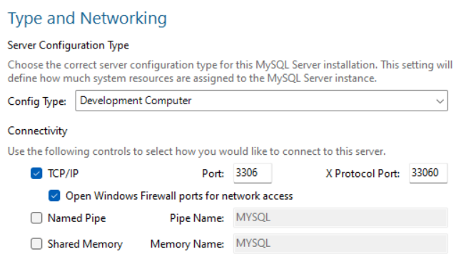

# Nedlastning og installering

[MySQL download links](https://dev.mysql.com/downloads/installer/)

Si nei takk til konto.

Velg custom, deretter MySQL server (nyeste versjon) og Workbench.

Installer.

# Konfigurasjon

- Bruk standardinnstillinger for type og nettverksporter.

- Velg "Strong Password Encryption"
- Accounts: Skriv inn Root password, husk dette.
- Windows Service: Evt. fjern hake ved "Start MySQL Server at startup"
- Server file permission: Grant full access
- Next og deretter Execute
- Connect to server: root og root password du valgte tidligere: "Connection succeeded" når det er suksess.
- Start MySQL workbench after install

# Lag første database i MySQL

- Åpne MySQL workbench
- Åpne MySQL connection (local host)
- I Query-vinduet, skriv `CREATE DATABASE myDB;`, der `myDB` er navnet på databasen
- Trykk på lyn-ikonet for å utføre kodelinjen i query-vinduet. 
- Se Output-fanen for å se resultatet. Se også under "Schemas", og trykk "Update"-knappen for å se "myDB".
- Høyre-klikk myDB og velg "Set as Default Schema" eller i query skriv "use myDB" (slett tidligere kode i query-panelet)

### Beskytt databasen
- I query skriv `ALTER DATABASE myDB READ ONLY = 1`, nå er den satt til read only. Tallet 0 fjerner read only.

### Lag første tabell
- I query skriv følgende, og trykk lynet for å "execute script":
  
`CREATE TABLE ansatte (
    ansatte_id INT,
    fornavn VARCHAR(50),
    etternavn VARCHAR(50),
    timelonn DECIMAL(5, 2),
    dato_ansatt DATE
)`

